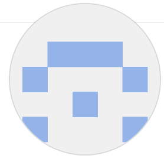
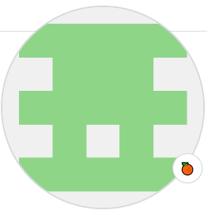

# 😀쿠팡랜드에 오신걸 환영합니다!😀
- 순구의 아이들은 코딩 연습 중 ㅎㅎㅎ

## 개발 배경
- HTML, CSS 학습 후 다양한 CSS 속성들과 태그 레이아웃 구조를 연습하기 위해 진행하였음
- 쿠팡 사이트 선정 이유는 다양한 레이아웃이 있어 float, flex, position 속성 등 다양한 연습을 하기 위함

## 개발 기간
- `23.03.13` ~ `23.03.15` (월~수)

## 개발 환경
### FrontEnd
- visual studio code, HTML, CSS
### 협업툴
- git, github
- Notion

## 역할 분담
- <<b>팀장</b>>박수민 : 로켓배송 페이지
- <<b>팀원</b>>이채원 : 고객센터 페이지
- <<b>팀원</b>>김영수 : 여행/티켓 페이지
- <<b>팀원</b>>송유근 : 쿠팡 메인페이지

### 로켓배송 페이지 - 수민

### 고객센터 페이지 - 채원

### 여행/티켓 페이지 - 영수

### 쿠팡 메인페이지 - 유근

### :family: 개발 팀원 소개

|   |   |   |  |
| ------------------------------------------------------------ | ------------------------------------------------------------ | ------------------------------------------------------------ | ------------------------------------------------------------ |
| **박수민** (팀장, 로켓 배송)                             | **이채원** (고객센터)                       | **김영수** (여행/티켓)                       | **송유근** (쿠팡 메인)                       |

## 회고록

| 이름   | 내용                                                         |
| ------ | ------------------------------------------------------------ |
| 박수민 | 깃을 활용하여 팀 프로젝트를 진행한 것이 이번이 처음이라 깃을 사용하면서 많은 어려움이 있었으나, 이번 프로젝트를 진행하면서 깃 사용에 익숙해질 수 있었습니다.  더불어 열심히 하는 팀원들을 보며 스스로 동기 부여도 많이 되었고 덕분에 짧은 시간이지만 많은 것들을 배운 값진 시간이였습니다. 기회가 된다면 다른 프로젝트도 같이 진행하고 싶습니다 ^^! |
| 이채원 | TEST |
| 김영수 | - 쿠팡 홈페이지의 여행/티켓 구간을 복제 구현해보았습니다. 자바스크립트 기능은 추가하지 못했고 HTML과 CSS를 이용하여 구현하였습니다.   - 기능으로는 수평정렬을 할 시 flex를 사용하지 않고 float를 이용하여 구현하였고, 글자마다 hover를 할 시 이미지가 커지는 기능을 구현하였습니다 그리고 이미지가 커질시 박스 바깥으로 보이는 현상을 막기위해 overflow: hidden 기능을 사용하였습니다.  - git 을 이용하여 협업을 하였는데 각자 이름으로 브랜치 생성을 하여 merge 할 시 충돌 문제가 발생하여 각 폴더에 각자의 파일을 담아 문제를 해결하였습니다. 약간의 문제였지만 나중에 프로젝트 할 시 충돌 문제가 안나오도록 좋은 경험을 하였던것 같습니다. 다른 팀원들이 열심히하는 모습을 보면서 동기 부여를 얻었던것 같고 정적인 홈페이지를 구현하였는데 다음번에는 애니메이션과 여러가지 기능이 있는 홈페이지를 구현해보고 싶습니다.  |
| 송유근 | 쿠팡 클론 메인 페이지를 3일 간 담당을 했습니다. 처음에는 쿠팡 페이지 화면을 보면서 HTML 구조를 잡아봤습니다. 특정한 사이즈에서는 깨지는 현상과 박스 사이즈에 잘 들어가지 않았습니다. 실제로 서비스 중인 쿠팡 페이지의 레이아웃들의 고정 픽셀들 값을 다 파악하고 레이아웃을 그림을 그렸습니다. float 방식과 flex 방식을 사용을 해봤는데 여백을 자동으로 계산해주는 flex 방식이 저에게 잘 맞았습니다. 학습으로만 배운 내용을 직접 구현을 해보면서 자신감이 많이 생겼습니다. 팀원분들 간에 조율과 공통적으로 겹치는 header, footer 부분 작업을 통해 협업의 장점을 깨달은 좋은 기회였습니다! github 사용법도 익숙해진 건 덤입니다.|
